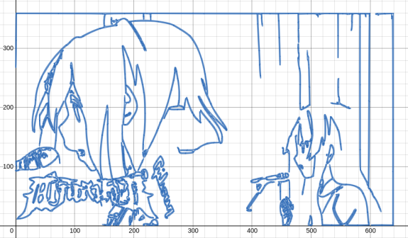

# Desmos Bezier Renderer


### Input


### Result


## Setup
Install dependencies

Debian/ubuntu

```sh
apt update
apt install git python3-dev python3-pip scrot ffmpeg
```
Arch

```sh
yay -S  git python3 python-pip potrace scrot agg ffmpeg
```


Clone repository
```sh
git clone https://github.com/MattFThornton/DesmosBezierRenderer
cd DesmosBezierRenderer
```

Install requirements
```sh
python3 -m venv env
. env/bin/activate
pip3 install -r requirements.txt
```

Create a directory called `frames` and add images named `frame%d.png` where `%d` represents the frame-number starting from 1. To render just a single image, add a single image named `frame1.png` in the directory. Works best with 360p to 480p resolution (may have to lower the resolution further with more complex frames). 

You can change the `DYNAMIC_BLOCK`, `BLOCK_SIZE`, and `MAX_EXPR_PER_BLOCK` constants in `backend.py` to change the number of expressions the backend will send to the frontend per call (too much will cause a memory error, too little could kill the backend with too many requests). This only really matters if you are rendering a video.
```sh
mkdir frames
...
```
in backend.py, edit the sleepTime variable based on your computer's speed. By default it's set to 90 which works for an old laptop, but for a faster computer, I'd reccomend setting it as 200 or greater(the higher the number the faster it generates the frames)


Run backend (This may take a while depending on the size and complexity of the frames). Should eventually show that the server is running on `localhost:5000`.
```sh
python3 backend.py
```

Load `index.html` into a web browser and run `start(0,0)` in the developer console. The image should start rendering or the video should start playing at a slow rate. If you want to start at a frame that isn't the first, change the first zero in start to the frame you want to start with.

after rendering all the images, use ffmpeg to combine all of them:

```sh
ffmpeg -r 29.97 -i frame_%003d.png out.mkv
```
change the `29.97` to the framerate of the source video to add sound: 

```sh
ffmpeg -i out.mkv -i sound.mp3 -shortest outWithSound.mkv
```

